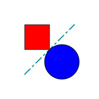

# SVG C Library

This is a library writen in C language for drawing SVG images.

[Scalable Vector Graphics](http://www.w3.org/Graphics/SVG/) are supported by all modern browsers and, no less important, supports almost all graphic primitives. In addition, interpolation by splines allows you to apply SVG for drawing function graphs.

SVG image is a text in the XML language. [SVG standard](http://www.w3.org/TR/SVG/) well documented and not difficult to even beginners.

## Install SVG C Library

To build and install **svgc** library from source distribution you have to clone this repository or download source tarball and then perform followind commands:

```Bash
$ git clone https://gitlab.radix.pro/kx/svgc.git
$ cd svgc
$ ./configure --prefix=/usr
$ make
$ sudo make install
```

If you work on Slackware machine the you can to install pacckage by following simple command:

```Bash
$ sudo installpkg svgc-1.0.8-x86_64-1.txz
```

Also we have package for **i686** architecture if you need.


## Quick Start

The programming principle is very simple. First of all we have to initialize needed data structures:

```C
#include <stdlib.h>
#include <stdio.h>

#include <svgc.h>

struct __svg_sheet   *sheet;
struct __svg_line    *line;
struct __svg_rect    *rect;
struct __svg_circle  *circle;

struct __svg_scene *scene;

int main( void )
{
  sheet = (struct __svg_sheet *)__svg_new_sheet( 200, 200, 10, 10, 10, 10 );
  if( !sheet )
  {
    printf( "Unable to create sheet\n" );
  }
  (void)__svg_set_stroke_width( (struct __svg_node *)sheet, 1.0 );

  scene = __svg_new_scene( sheet );
  if( !scene )
  {
    printf( "Unable to create scene\n" );
  }
```

Then we have to fill the list of graphical primitives:

```C
  /* Set current values for newest objects: */
  __svg_set_scene_stroke( "black" );
  __svg_set_scene_stroke_width( 1.0 );
  __svg_set_scene_stroke_linecap( LINECAP_SQUARE );
  __svg_set_scene_fill( "none" );

  rect = (struct __svg_rect *)__svg_new_rect( 50.0, 50.0, 50.0, 50.0, 0, 0 );
  (void)__svg_set_fill_rgb( (struct __svg_node *)rect, 255, 0, 0 );
  (void)__svg_scene_add_node( scene, (struct __svg_node *)rect );


  /* Set current values for newest objects: */
  __svg_set_scene_stroke_width( 2.0 );
  __svg_set_scene_stroke_rgb( 0, 138, 147 );
  __svg_set_scene_stroke_dasharray( "15,7,3,7" );

  line = (struct __svg_line *)__svg_new_line( 50.0, 150.0, 150.0, 50.0 );
  (void)__svg_scene_add_node( scene, (struct __svg_node *)line );


  /* Set current values for newest objects: */
  __svg_set_scene_stroke( "black" );
  __svg_set_scene_stroke_width( 1.0 );
  __svg_set_scene_stroke_dasharray( "none" );
  __svg_set_scene_fill_rgb( 0, 0, 255 );

  circle = (struct __svg_circle *)__svg_new_circle( 125.0, 125.0, 35.0 );
  (void)__svg_scene_add_node( scene, (struct __svg_node *)circle );
```

Finally, we need to write an image to a file:

```C
  __svg_paint_scene( scene, 0, "M.svg" );

  __svg_free_scene( scene );

  return( 0 );
}
```

This program will produce following picture:



To build this programm you can make use following Makefile:

```Makefile
all: main

main: main.o
	gcc `svgc-config --ldflags`-o main main.o `svgc-config --libs` -lm

main.o: main.c
	gcc `svgc-config --cflags`-c main.c -o main.o

clean:
	rm *.o main
```

